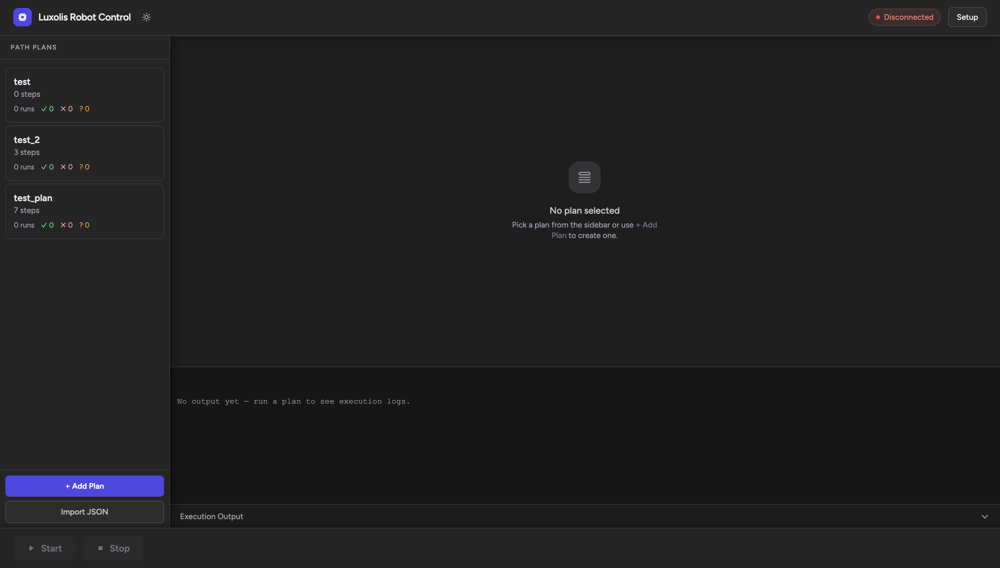

# Robot Control UI v2

| Light mode                         | Dark mode                        |
| ---------------------------------- | -------------------------------- |
|  |  |

Web UI for Doosan A0912 robot arm. Load plan, connect, run. Hand teaching, jog, turntable, and laser welding supported.

No ROS2. Direct DRFL C++ API. Works on Ubuntu 18.04 / 20.04 / 22.04 / 24.04.

## Prerequisites

```bash
sudo apt-get install -y g++ cmake libcurl4-openssl-dev git
```

No `libpoco-dev` needed, Doosan bundles Poco inside the API-DRFL repo.

## Build daemon

```bash
cd lux_drfl_daemon
git submodule update --init third_party/API-DRFL
cmake -B build -DDRCF_VERSION=3 .
cmake --build build -j$(nproc)
```

## Run

```bash
python3 -m venv .venv
.venv/bin/pip install -r requirements.txt
.venv/bin/python3 server.py
```

Open `http://localhost:8000`. Internet needed for CDN scripts.

## How it works

- `server.py` : FastAPI + WebSocket backend, no database
- On Connect: spawns `lux_drfl_daemon/build/drfl_daemon` as persistent subprocess
- Daemon owns DRFL robot connection, executes all motion commands
- Commands = newline-delimited JSON → daemon stdin
- Sentinels (`[CONNECTED]`, `[STEP_START] N`, `[DONE]`, `[ERROR]`) → daemon stdout → WebSocket → UI state
- Plans = JSON files in `plans/`, run history in `stats/`
- Frontend = Alpine.js + Tailwind CDN, no build step

## Hand teaching

1. Open plan → Hand Guide tab → Enable
2. Move arm → Record → point appears in step list
3. Steps draggable to reorder
4. MoveJ ↔ MoveL switch resets position values

## Jog

Move the arm one axis at a time from the Jog tab. Joint and Cartesian reference frames supported. Use Capture Pose to snapshot the current TCP position into a plan step's geometry fields (pos_a, pos_start, pos_via, etc.).

## Turntable and laser

Arduino-based turntable connects over USB serial (auto-detected). Per-step control: enable turntable, fire laser, or both simultaneously. Parallel mode spins the turntable continuously while the robot runs all steps. Sequential mode interleaves Turntable and Laser steps between robot moves. EMG button on the Arduino halts all motion immediately and shows a blocking overlay until released.

## Architecture

**Single dir.** `robot_ui_v2/` contains server + daemon. No sibling repos needed.

**Persistent daemon.** `lux_drfl_daemon` owns one DRFL connection exclusively, replaces ROS2 `dsr_bringup2` + `move_joint_node` + `pose_capture_node`.

**Sentinel-driven UI.** No polling. One WS connection = terminal output + UI state.

**Flat JSON files.** No database. Plans editable directly on disk.

**Multi-Ubuntu.** Doosan ships `libDRFL.a` + Poco `.so` for 18.04/20.04/22.04/24.04 (amd64 + arm64). Docker build arg selects version:

```bash
docker build --build-arg UBUNTU_VERSION=18.04 .   # JetPack 4.6
docker build --build-arg UBUNTU_VERSION=20.04 .   # JetPack 5.x
docker build .                                     # JetPack 6.x (default 22.04)
```
